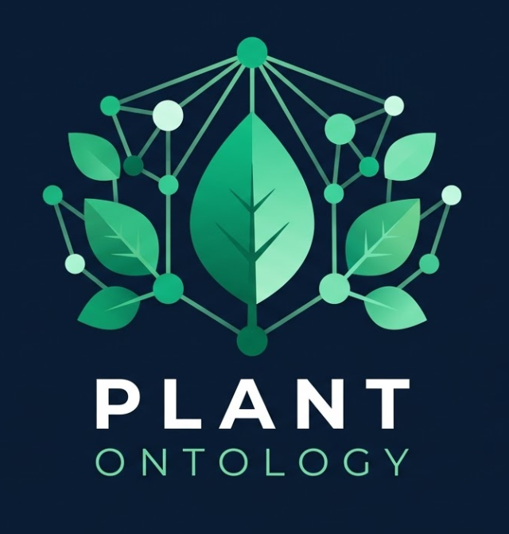

<div align="center">
  

  # PlantOntology

  **The world's first open-source plant knowledge graph** — built by landscape professionals, for everyone.

  [](LICENSE)
  [](https://neo4j.com)
  [](https://python.org)
  [](https://modelcontextprotocol.io)
  [](#)
</div>

**PlantOntology** is an open-source knowledge graph that models plants, ecosystems, and landscape design relationships — making 19 years of professional landscape expertise available to everyone through AI.

---

## 🌍 Why PlantOntology?

Existing plant databases (iNaturalist, GBIF, Plants.com) store **facts** — scientific names, photos, basic traits.

PlantOntology stores **relationships** and **intelligence**:

```
수종 ──[동반식재]──▶ 수종          # Companion planting
수종 ──[기피관계]──▶ 수종          # Allelopathy / conflict
수종 ──[기후적합]──▶ 기후존        # Climate zone match
수종 ──[유지관리]──▶ 난이도        # Maintenance complexity
수종 ──[생태역할]──▶ 조류/곤충     # Ecological function
수종 ──[병해충]───▶ 방제법         # Pest/disease management
포장 ──[심미조합]──▶ 수종군        # Aesthetic combinations
토양 ──[적합수종]──▶ 수종          # Soil-species match
```

This powers questions like:
- *"느티나무 옆에 뭘 심으면 좋을까?"* → companion planting recommendations
- *"서울 기후에서 자생종으로 공원 식재 계획 짜줘"* → AI-generated planting plans
- *"이 배치가 생태적으로 건강한가?"* → ecosystem health scoring
- *"드라이가든용 내건성 수종 20종 추천"* → climate-adaptive selection

---

## 🎯 Who is this for?

| User | Use Case |
|------|----------|
| 🏡 Home gardeners | "What should I plant next to my roses?" |
| 🌇 Urban planners | Green infrastructure optimization |
| 🏗️ Landscape architects | Design automation & spec generation |
| 🌍 Climate adaptation orgs | Drought-resistant, carbon-sequestering planting |
| 🤖 AI developers | Training data for AEC/landscape AI models |
| 🎓 Students | Open educational resource for landscape programs |

---

## 🗂️ Project Structure

```
PlantOntology/
├── data/
│   ├── species/           ← Plant species JSON (Korean + global)
│   ├── relationships/     ← Companion, conflict, ecological edges
│   ├── climate_zones/     ← Korean climate zones (쾨펜 분류)
│   └── regulations/       ← 도시공원법, 건축법 조경 기준
├── ontology/
│   ├── schema.cypher      ← Neo4j node/relationship schema
│   └── constraints.cypher ← Unique constraints & indexes
├── api/
│   ├── main.py            ← FastAPI app
│   └── routers/           ← /species, /recommend, /plan, /ecosystem
├── sdk/
│   └── plantontology/     ← Python SDK (pip install plantontology)
├── mcp/
│   └── server.py          ← MCP server for Claude Code integration
└── scripts/
    ├── seed_neo4j.py      ← Load initial dataset into Neo4j
    └── import_gbif.py     ← Import from GBIF open data
```

---

## 🚀 Quick Start

```bash
git clone https://github.com/alexai-mcp/PlantOntology
cd PlantOntology
pip install -e ".[dev]"

# Start Neo4j (Docker)
docker run -p 7474:7474 -p 7687:7687 neo4j:latest

# Seed initial dataset
python scripts/seed_neo4j.py

# Start API
uvicorn api.main:app --reload
```

### Use as MCP Server (Claude Code)
```json
{
  "mcpServers": {
    "plantontology": {
      "command": "python",
      "args": ["-m", "mcp.server"],
      "cwd": "/path/to/PlantOntology"
    }
  }
}
```

---

## 📚 Documentation

- **[Getting Started](GETTING_STARTED.md)** — Setup and first queries
- **[Contributing Guide](CONTRIBUTING.md)** — How to contribute
- **[Changelog](CHANGELOG.md)** — What's new in each release
- **[OpenCrab Grammar](docs/ONTOLOGY.md)** — 9-space semantic architecture
- **API Reference** — REST API endpoints (coming soon)
- **[Neo4j Setup](docs/NEO4J_SETUP.md)** — Full database configuration

---

## 🌱 Initial Dataset (Korean Native + Ornamental)

Phase 1: **500 species** with full relationship data
- 한국 자생 수종 200종 (Korean native trees/shrubs)
- 조경 활용 교목/관목 200종 (Common landscape species)
- 지피식물/초화류 100종 (Ground covers & perennials)

Each species includes:
- 학명 / 국명 / 영명
- 생육 특성 (수고, 수폭, 생장속도)
- 기후 적합성 (한국 기후존 1–7)
- 토양 적합성
- 유지관리 난이도
- 동반식재 / 기피 관계
- 생태 기능 (탄소흡수, 조류유인, 밀원)
- 조경 활용처 (가로수, 공원, 정원, 옥상녹화)

---

## 🗺️ Roadmap

| Phase | Milestone | ETA |
|-------|-----------|-----|
| v0.1 | 한국 자생 수종 200종 + Neo4j 스키마 | 2026-04 |
| v0.2 | FastAPI + 추천 엔진 MVP | 2026-05 |
| v0.3 | MCP 서버 + Claude Code 통합 | 2026-05 |
| v0.4 | 글로벌 수종 확장 (아시아 1,000종) | 2026-06 |
| v1.0 | 기후 적응 식재 계획 자동 생성 | 2026-Q3 |

---

## 🤝 Contributing

PlantOntology thrives on contributions from:
- **Landscape architects** — domain knowledge, species data
- **Botanists** — ecological relationships, taxonomy
- **AI engineers** — Graph RAG, recommendation algorithms
- **Translators** — Korean ↔ English ↔ Japanese species data
- **Gardeners** — real-world companion planting observations

See [CONTRIBUTING.md](CONTRIBUTING.md) for guidelines.

---

## 📄 License

MIT — free to use, modify, and distribute.

---

*Built with 19 years of landscape expertise + AI by [AlexLee](https://github.com/alexai-mcp)*
*Powered by Neo4j · FastAPI · Claude Code MCP*
